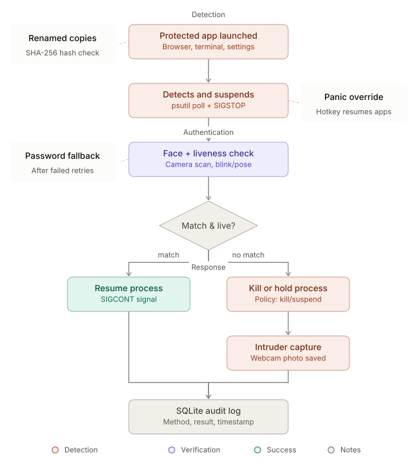
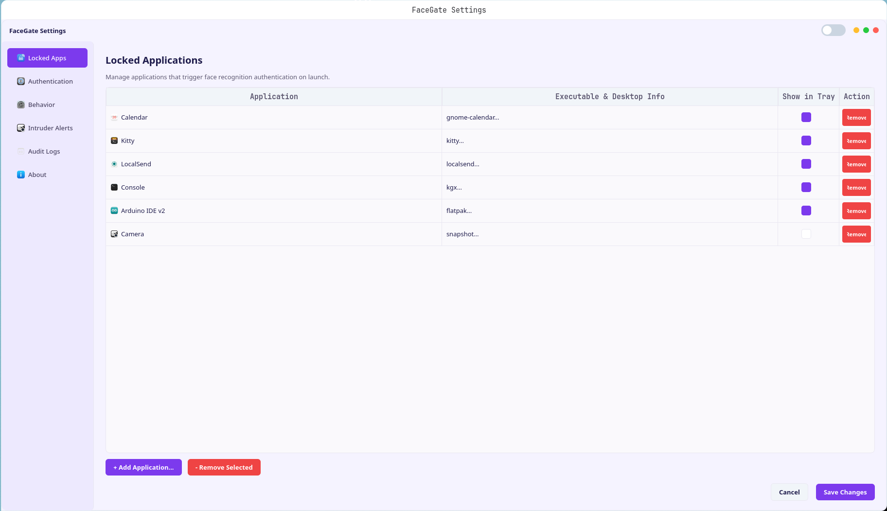
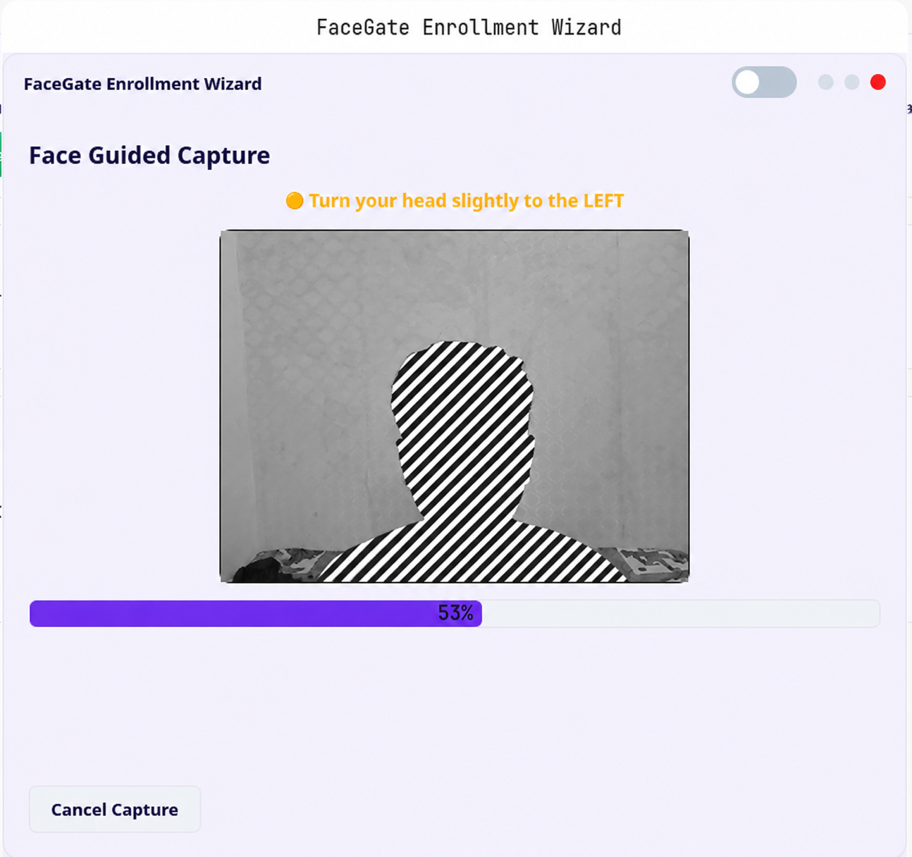
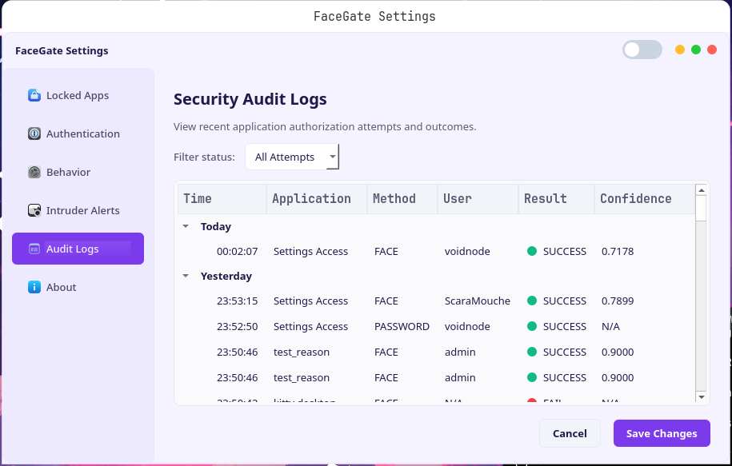
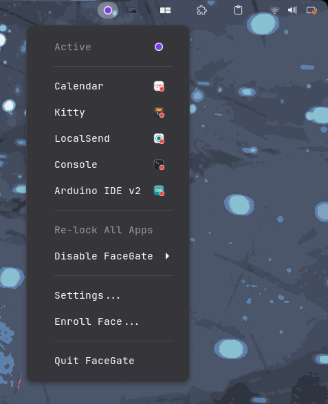

# FaceGate-Linux 🛡️👤

<p align="center">
  
  

  
  
  
  
  
  <a href="GUIDE.md"></a>
</p>

**FaceGate-Linux** is an advanced, local biometric application security daemon and tray interface for Linux desktop environments. Designed to prevent unauthorized access to sensitive application windows (such as web browsers, terminal consoles, password managers, or system settings), FaceGate intercepts target launches and gates them behind fast, local biometric face recognition (powered by InsightFace) and liveness checking, with a secure Master Password fallback.

<p align="center">
  
</p>

---

## 📋 Table of Contents

- [✨ Features & Highlights](#-features--highlights)
- [📖 User & Developer Guide](#-user--developer-guide)
- [🏗️ System Architecture](#-system-architecture)
- [🔐 Security Model & Limitations](#-security-model--limitations)
- [🚀 Quick Start & Installation](#-quick-start--installation)
- [📸 Screenshots & Visual Interface](#-screenshots--visual-interface)
- [🤝 Contributing & Open-Source Roadmap](#-contributing--open-source-roadmap)
- [👥 Contributors & Community](#-contributors--community)
- [📄 License](#-license)

---

## ✨ Features & Highlights

- 🔒 **Biometric Application Locking**: Automatically detects target process launches and suspends them via `SIGSTOP` until authenticated.
- 👤 **Primary Admin & Multi-User Access Control**: Gated settings access requiring Primary Admin face or Master Password verification. Admins can manage, test, re-enroll, or delete facial profiles.
- ⚡ **Local & Private Face Recognition**: Powered by ONNX Runtime and the lightweight `buffalo_l` InsightFace model for 100% offline, private, real-time biometric verification.
- 👁️ **Liveness Checking & Spoof Protection**: Bounding-box centroid micro-motion tracking protects against static photo bypass attempts.
- 📸 **Intruder Selfie Gallery**: Automatically captures webcam photos of unauthorized access attempts and displays them in a high-contrast visual gallery.
- 🔑 **RAM-Backed Session Key Vault**: Encryption keys are cached in user-private RAM `tmpfs` (`/run/user/{uid}/facegate.key`), enabling seamless face recognition across desktop sessions while maintaining AES-256-GCM encryption-at-rest.
- 🎨 **Modern High-Contrast Dark & Light Design System**: Stunning PySide6 GUI with vibrant color palettes (`#c084fc` headers, slate cards, transparent viewports, custom `QComboBox` delegates).
- 🛡️ **Uninstall & Panic Override**: Built-in anti-uninstall protection, panic lockdown hotkeys (`<Control><Alt>l`), and emergency recovery shortcuts (`<Control><Alt>k`).
- 📜 **Tamper-Evident Audit Trail**: Local SQLite logging tracking authorization attempts, confidence scores, and access outcomes.

---

## 📖 User & Developer Guide

Check out our full, in-depth **[User & Developer Guide (`GUIDE.md`)](GUIDE.md)** for exhaustive details on:
- 💻 **Complete CLI Terminal Commands & Flags** (`--monitor`, `--settings`, `--enroll`, `--disable`, `--lock-all`, etc.)
- ⚙️ **Detailed Configuration Schema** (`config/default.yaml`)
- 🖥️ **Desktop Integrations** (GNOME, KDE Plasma, XFCE, Sway, Hyprland)
- 🧪 **Comprehensive Pytest Guide & Module Breakdown**

---

## 🏗️ System Architecture

<p align="center">
  
</p>

---

## 🔐 Security Model & Limitations

FaceGate-Linux is designed to protect your personal desktop session from physical-presence intruders and unauthorized local access:

### 1. User-Level Scope & Root Shell Limitation
FaceGate-Linux runs as an unprivileged user-level daemon (`systemd --user`). A local user with **root (superuser) privileges** can bypass process suspension or stop the daemon. FaceGate is optimized for personal desktop session privacy.

### 2. Process Suspension & Binary Resolution
Process launches are monitored via `psutil` and desktop launcher substitution (`.desktop` files). Canonical path resolution (`os.path.realpath`) prevents path-aliasing bypasses, while SHA-256 binary hash checking handles binary copies.

---

## 🚀 Quick Start & Installation

### Prerequisites
- Linux Desktop Environment (GNOME, KDE Plasma, XFCE, Sway, Hyprland)
- Python 3.11+ & Poetry
- OpenCV & PySide6 dependencies

### Installation
```bash
# 1. Clone the repository
git clone https://github.com/ScaraMouche-Wanderer/FaceGATE-Linux.git
cd FaceGATE-Linux

# 2. Run the automated installer
./install.sh
```

### Running Tests
```bash
poetry run pytest tests/ -v
```

---

## 📸 Screenshots & Visual Interface

| High-Contrast Settings Dashboard | Enrollment & Calibration Wizard |
|----------------------------------|---------------------------------|
|  |  |

| Biometric Authentication Dialog | Audit Logs & Intruder Gallery |
|---------------------------------|-------------------------------|
|  |  |

---

## 🤝 Contributing & Open-Source Roadmap

Contributions make the open-source community an amazing place to learn, inspire, and create! We warmly welcome all contributions.

### 🌟 Good First Issues & Contribution Ideas

Looking to contribute? Here are some great areas to get started:

- 🌐 **Internationalization (i18n)**: Add multi-language translations (`.qm` / `.json`) for GUI strings.
- 🎨 **UI Preset Palettes**: Create and submit new color scheme presets in `src/ui/theme.py`.
- 🖥️ **Desktop Shell Extensions**: Build GNOME extension / KDE KWin plasmoid integration for quick toggling.
- 🔌 **PAM Module**: Help build `pam_facegate` for Linux login/sudo PAM integration.
- 🧪 **Hardware Benchmark Profiling**: Add CUDA / TensorRT ONNX provider optimizations in `tests/benchmark_fps.py`.

### How to Get Started
1. Read our **[CONTRIBUTING.md](CONTRIBUTING.md)** guide for architecture breakdowns and step-by-step instructions.
2. Check out open **[GitHub Issues](https://github.com/ScaraMouche-Wanderer/FaceGATE-Linux/issues)** or pick up a `good first issue`.
3. Fork the repository, create your feature branch, run `poetry run pytest tests/ -v`, and open a Pull Request!

---

## 👥 Contributors & Community

Thank you to everyone helping build and improve FaceGate-Linux!

<a href="https://github.com/ScaraMouche-Wanderer/FaceGATE-Linux/graphs/contributors">
  
</a>

---

## 📄 License

This project is licensed under the MIT License. See the [LICENSE](LICENSE) file for details.
